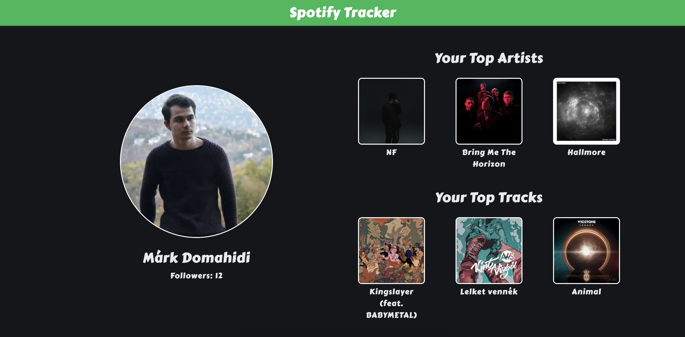

# Spotify Tracker

Simple Next.js application that displays some information about an authenticated Spotify user.



## Getting started

### Prerequisites

**1. Get the correct Node version for this project**

```bash
nvm install
```

**2. Generate the necessary environment variables**

```bash
npm run generate-env
```

**3. Setup a Spotify account**

This application is using the Spotify Web API under the hood, therefore you must create a Spotify user account (Premius or Free) to use it. To do that, simply sign up at [www.spotify.com](www.spotify.com).

When you have a user account, go to the [Dashboard](https://developer.spotify.com/dashboard) page at the Spotify Developer website and, if necessary, log in. Accept the latest [Developer Terms of Service](https://developer.spotify.com/terms) to complete your account set up.

**4. Register this application**

The next step is to register this application following [these steps](https://developer.spotify.com/documentation/general/guides/authorization/app-settings/).

**5. Provide credentials**

The last step is to provide the necessary `SPOTIFY_CLIENT_ID` and `SPOTIFY_CLIENT_SECRET` variables in the generated `env.local` file.

### Installation

**1. Install all dependencies**

```bash
npm install
```

### Usage

| Command                | Description                                        |
| :--------------------- | :------------------------------------------------- |
| `npm run start`        | Start the application                              |
| `npm run build`        | Build the application                              |
| `npm run clean`        | Clean the last build of the application            |
| `npm run dev`          | Start the application in development mode          |
| `npm run lint`         | Run linter on the application                      |
| `npm run generate-env` | Generate environment variables for the application |

## Author

Domahidi Márk
